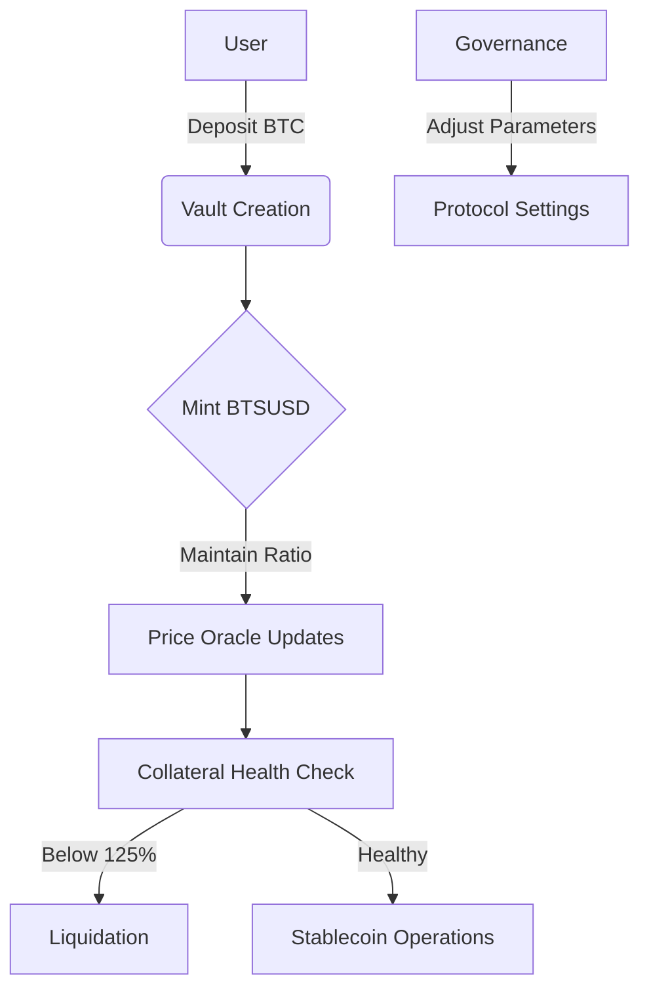

# BitSats Protocol (BTSUSD)

## A Bitcoin-Backed Stablecoin Protocol on Stacks Layer 2

## 🧾 Overview

**BitSats Protocol** is a decentralized stablecoin system enabling Bitcoin holders to mint USD-pegged tokens while maintaining custody of their BTC. Built natively on **Stacks Layer 2**, it combines Bitcoin's security with smart contract programmability through:

- Non-custodial BTC collateralization
- SIP-010 compliant stablecoin operations
- Decentralized price oracle network
- Automated risk management

---

## 🌟 Key Features

🛡️ **Bitcoin-Collateralized**  
150% minimum over-collateralization with BTC

📊 **Decentralized Oracles**  
Tamper-resistant BTC/USD price feeds from multiple sources

⚡️ **Auto-Liquidation**  
Positions liquidated at 125% collateral threshold

🔐 **Non-Custodial Design**  
Users retain full control of private keys

🔄 **SIP-010 Compliance**  
Standardized token interface for ecosystem integration

🗳️ **Progressive Governance**  
Phased transition to decentralized parameter control

---

## ⚙️ Protocol Architecture

### Core Components

```
                          ┌───────────────────────┐
                          │       User Vaults     │
                          │  - Collateral Storage │
                          │  - Debt Management    │
                          └──────────┬────────────┘
                                     │
                          ┌──────────▼──────────┐
                          │  Collateral Engine   │
                          │ - Ratio Enforcement  │
                          │ - Health Monitoring  │
                          └──────────┬───────────┘
                                     │
                          ┌──────────▼──────────┐
                          │  Oracle Aggregator  │
                          │ - Price Validation  │
                          │ - Data Redundancy   │
                          └──────────┬───────────┘
                                     │
                          ┌──────────▼──────────┐
                          │ Liquidation System  │
                          │ - Threshold Checks  │
                          │ - Auction Mechanism │
                          └──────────┬───────────┘
                                     │
                          ┌──────────▼──────────┐
                          │ Governance Module   │
                          │ - Parameter Control │
                          │ - Protocol Upgrades │
                          └─────────────────────┘
```

### System Flow



---

## 📜 Smart Contract Details

### Key Parameters

| Parameter               | Value  | Description                          |
|-------------------------|--------|--------------------------------------|
| Minimum Collateral Ratio | 150%  | Initial collateral requirement       |
| Liquidation Threshold   | 125%   | Auto-liquidation trigger             |
| Mint Fee                | 0.5%   | Charged when minting BTSUSD          |
| Redemption Fee          | 0.5%   | Charged when redeeming BTC           |
| Max Vault Debt          | 1M BTS | Per-vault minting limit              |

### Core Functions

**User Operations**
- `create-vault`: Initialize BTC collateral position
- `mint-stablecoin`: Generate BTSUSD against collateral
- `redeem-stablecoin`: Burn BTSUSD to recover BTC

**Risk Management**
- `liquidate-vault`: Execute undercollateralized positions
- `update-btc-price`: Oracle node price submission

**Governance**
- `update-parameters`: Adjust fees/ratios (timelocked)
- `manage-oracles`: Add/remove price feed providers

---

## 🛡️ Security Model

### Protocol Safeguards

- **Multi-Source Oracles**: 3+ authenticated price feeds
- **Circuit Breakers**: Pause minting during extreme volatility
- **Timelock Changes**: 72-hour delay for critical parameter updates
- **Overcollateralization Buffer**: 25% safety margin

### Audit Considerations

1. Oracle manipulation resistance
2. Fair liquidation processes
3. Precision in collateral calculations
4. Reentrancy protection
5. Front-running mitigation

---

## 🗳️ Governance

**Phased Decentralization**

| Phase | Control Mechanism          | Key Responsibilities               |
|-------|----------------------------|-------------------------------------|
| 1     | Foundation Multisig        | Emergency stops, oracle management |
| 2     | STX Holder Voting          | Fee adjustments, ratio changes     |
| 3     | BTSUSD Governance Token    | Full protocol control              |

---

## 💼 Example Use Case

1. **Vault Creation**: Alice deposits 1 BTC (value $50,000)
2. **Minting**: Mints 33,333 BTSUSD ($50,000/1.5) minus 0.5% fee
3. **Price Drop**: BTC falls to $40,000 (CR = 133%)
4. **Liquidation Threshold**: If BTC drops below $37,500 (CR 125%), vault becomes liquidatable
5. **Recovery**: Alice adds collateral or repays debt to maintain safe position

---

## 🛠️ Development

### Requirements
- Clarinet 2.0+
- Node.js 16.x
- Stacks.js SDK

### Quick Start
```bash
git clone https://github.com/bitsats-protocol/core.git
cd bitsats-protocol
npm install
clarinet check
```

## 🌍 Future Roadmap

- sBTC integration for trustless BTC wrapping
- Multi-collateral support (wBTC, Stacks NFTs)
- Liquidation auction marketplace
- DAO-governed treasury system
- Cross-chain bridge integrations

---

## 🤝 Contributing

We welcome contributions through:
- Protocol improvements via RFC process
- Security audits and bug reports
- Documentation translations
- Ecosystem integrations

**Resources**  
[Stacks Documentation](https://docs.stacks.co/) | 
[SIP-010 Standard](https://github.com/stacksgov/sips)
